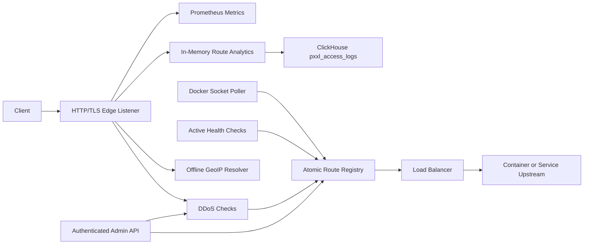

# Architecture

Pxxl Proxy is organized around a small hot path and several asynchronous control-plane loops.

## Hot Path

The request hot path is:

1. Accept TCP or TLS connection.
2. Read HTTP request with Hyper.
3. Extract host and path.
4. Check in-memory blacklist and rate limiter.
5. Resolve location from the offline GeoIP CIDR table.
6. Match route from the atomic route registry.
7. Enforce domain rules, including IP/location allow/block lists, WAF checks, and rate limits.
8. Pick a traffic-split or location-specific upstream pool when rules match.
9. Select a healthy upstream.
10. Stream the request and response with Hyper.
11. Emit structured logs, Prometheus metrics, aggregate route stats, recent visit records, and queued ClickHouse analytics events.

No database, internet GeoIP API, Redis lookup, ClickHouse write, health-check probe, or Docker socket access is required to forward a request.

## Control Plane

- Static config loads from `config/pxxl.toml`.
- Docker discovery polls `/var/run/docker.sock` and replaces Docker-sourced routes atomically.
- Podman discovery can poll a Podman-compatible socket and map labels into the same route model.
- Admin API mutates in-memory blacklist state and exposes operational views.
- Admin API can require bearer tokens stored in Redis and optional client IP allowlists.
- API-created routes are persisted in Redis and loaded into the in-memory registry.
- Offline GeoIP records load from `config/geoip/geoip.csv` at startup.
- ClickHouse analytics writer consumes a best-effort queue and creates `pxxl_access_logs`.
- TLS reloader regenerates the local certificate when route domains change.
- Health checker periodically updates upstream `healthy` flags from HTTP probes.
- Redis sync is prepared for blacklist pub/sub propagation across nodes.

## Crate Boundaries

- `common`: shared route, upstream, listener, and error types
- `config`: TOML parsing and normalization
- `core`: route registry and shared runtime state
- `geo`: offline CIDR-based GeoIP resolver
- `http-proxy`: Hyper/Tokio proxy listeners
- `tls`: local certificate generation and rustls config
- `docker-discovery`: Docker label discovery
- `ddos`: blacklist and rate limiting
- `load-balancer`: upstream selection algorithms
- `metrics`: Prometheus registry
- `api`: admin and metrics HTTP endpoints
- `redis-sync`: blacklist pub/sub hooks
- `storage`: ClickHouse analytics writer and storage boundary types
